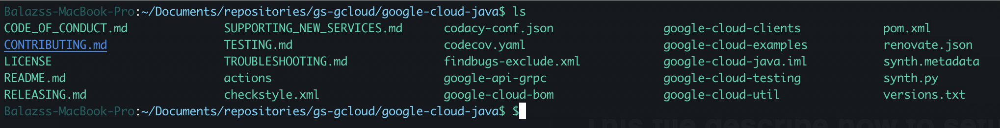

# This file describe how to setup iTerm Appearance



## .zshrc config file (under Applications/iTerm - this file not exist by default we should create it)

## command:
`open ~/.zshrc`

## colors can be found here: 
https://unix.stackexchange.com/questions/124407/what-color-codes-can-i-use-in-my-ps1-prompt

# add the following lines:
```
export autoload -U colors && colors
export PS1="%F{023}%K{000}%m%F{015}%K{000}:%F{081}%K{000}%~%F{043}%K{000}\$ "
```
