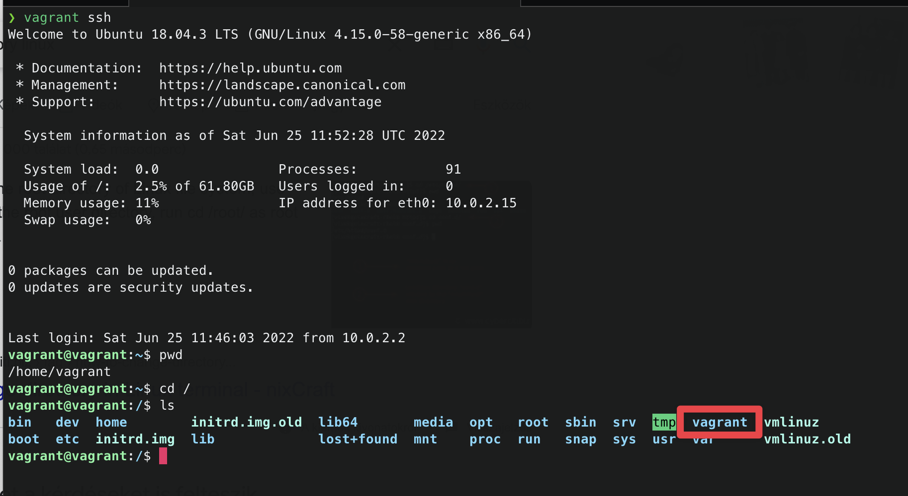

# Vagrant

Install: `brew install vagrant`

[Your first virtual machine](https://learn.hashicorp.com/tutorials/vagrant/getting-started-index)

`vagrant init hashicorp/bionic64`  
`vagrant up`  
`vagrant ssh`  
`vagrant destroy`
To reload only with `shell` provision: `vagrant reload --provision-with shell`

### Shared dir

There is a vagrant dir in home (`cd /` after ssh), where you can found everything that is next to `Vagrant` file

